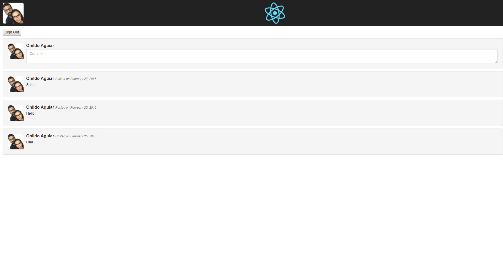
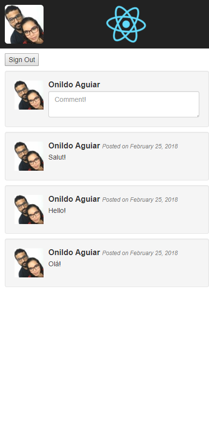

# About
Comments system made with React.

## Website
https://reacomments.firebaseapp.com/

## GitHub Pages
https://onildoaguiar.github.io/reacomments/

# Screenshots

## Desktop

## Mobile

# License
This project is licensed under the MIT License - see the LICENSE.md file for details